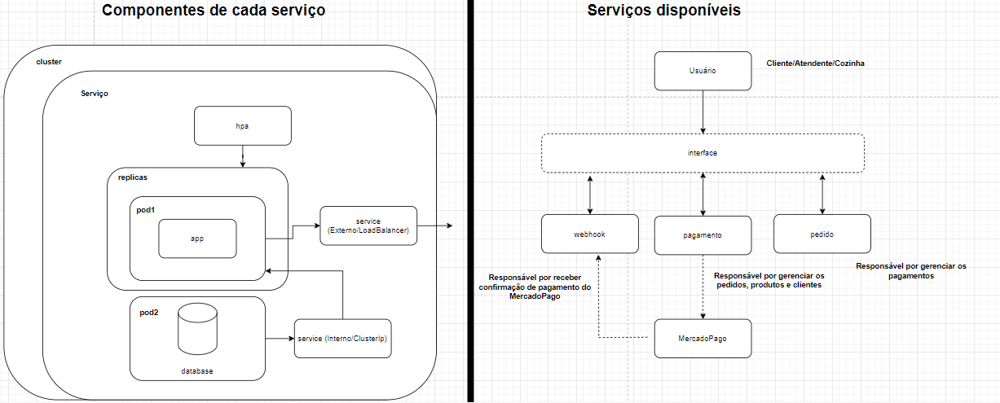

# fiap-g58-fase02

## Arquitetura Geral
O projeto conta com 3 serviços 
### Pedidos
O serviço contido em **pedidos-cadastro-api** é responsável por
gerenciar pedidos, clientes, produtos e categorias de produtos.
Sendo utilizado para inicializar pedidos e acompanha-los

### Pagamentos
O serviço contido em **pedidos-pagamento-api** é responsável por
gerenciar a criação e a confirmação de pagamentos. Para tanto,
esse serviço faz uma requisição ao Mercado Pago para a criação
de um QR code. Esse serviço também é chamado pelo webhook e
atualiza a situação do pedido quando o mesmo é pago

### Webhook de pagamento
O serviço contido em **pedidos-webhook-api** é responsável
por escutar qualquer confirmação de pagamento enviada pelo
Mercado Pago e enviá-la ao serviço de pagamento.

